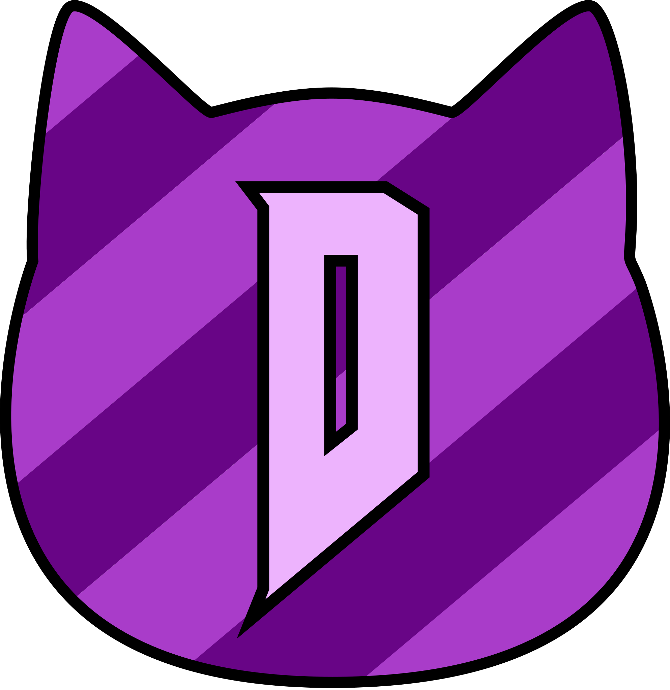

    
    <h1>Nyan Doom</h1>
    <h3>The most fuzzy, cuddly Doom port ever!</h3>

 

 

[Doomworld thread](https://www.doomworld.com/forum/topic/145913/)

## About the source port
Nyan Doom is based on the DSDA-Doom source port, but adds many more quality-of-life and innovative features! If you like the DSDA-Doom, but wanted a few extra whistles and customisations, then this is the port for you!

## Downloads

Available for Windows, macOS and Linux in [Releases](https://github.com/andrikpowell/nyan-doom/releases/latest)

  
Dev builds

  
  <a href="https://github.com/andrikpowell/nyan-doom/actions">https://github.com/andrikpowell/nyan-doom/actions</a>

  Requires a github account to download and are only available for a 90 days after creation.
  
  > May be completely broken and unusable

## Key Features
- New [animated background / menu element](./docs/animbg.md) lump support (for animated M_DOOM, TITLEPIC, INTERPIC, etc)
- Native [widescreen](./docs/ws.md) lump support for widescreen assets (avoiding the need for separate asset WADs)
- Support for [GAMEVERS](./docs/gamevers.md) lump in combination with [COMPLVL](./docs/complvl.md) to further specify Vanilla compatibility.
- [Limit-Removing Support](./docs/limit_removing.md) for Vanilla style maps to ignore overflow errors (such as all-ghosts, etc)
- Native "berserk" and "armour" elements on the statusbar *(Options > Display)*
- Extended HUD "Status Widget" showing currently active powerups *(Options > Display)*
- Savegame support for per-game modifiers (`pistol start`, `respawn`, `fast monsters`, etc)
- Experimental "Light Amplification Visor" screen effect
- In-depth "Boom Translucency" customization
- Smarter "Colored Blood" option
- Enhanced ENDOOM support
- All DSDA-Doom features... and more!

## Patch Notes
- [v1.2](./patch_notes/v1.2.md)
- [v1.1](./patch_notes/v1.1.md)

## Compiling

Code available at [https://github.com/andrikpowell/nyan-doom/](https://github.com/andrikpowell/nyan-doom/)

Instructions in [guides](./docs/guides/)

## Notice
Nyan Doom code is based off [DSDA-Doom](https://github.com/kraflab/dsda-doom). This means that certain features already in DSDA-Doom (and by extension Nyan Doom) may be broken or unfinished, especially in regards to Heretic and Hexen support. Here is some documentation on those features:

  
Heretic Support

### Heretic Support
- Nyan Doom includes demo-compatible support for heretic (all the demos stored on dsda are in sync).
- Heretic game logic should be set automatically if you use `HERETIC.WAD` as the iwad. If it doesn't work, please use the `-heretic` commandline option. This flips a switch in the engine that determines all the core game data.
- Don't need to supply complevel (heretic is complevel 0 by necessity)
- Known issues
  - Setting the "Status Bar and Menu Appearance" option to "not adjusted" will have no effect for heretic (it will default instead to "Doom format").
  - The "Apply multisampling" automap option is disabled for heretic.
  - Automap colors are not configurable for heretic.
  - Some of the more advanced features are not implemented for heretic yet, and using them may cause crashes or other odd behaviour.
  - Dehacked support for heretic isn't implemented yet.
  - Some menus extend over the hud.

  
Hexen Support

### Hexen Support
- Nyan Doom includes demo-compatible support for hexen.
  - Use -iwad HEXEN.WAD (-file HEXDD.WAD for the expansion)
    - Or drag wads onto the exe
  - You can force hexen engine behaviour with `-hexen` (shouldn't be necessary)
- Don't need to supply complevel (hexen is complevel 0 by necessity)
- Known issues
  - Setting the "Status Bar and Menu Appearance" option to "not adjusted" will have no effect for hexen (it will default instead to "Doom format")
  - The "Apply multisampling" automap option is disabled for hexen
  - Automap colors are not configurable for hexen
  - Some of the more advanced features are not implemented for hexen yet, and using them may cause crashes or other odd behaviour.
  - Some menus extend over the hud.
  - Monster counter doesn't work as expected, due to cluster format (ex hud / levelstat)
  - Hexen-style skies aren't implemented yet (layering, etc)
  - The ALTSHADOW thing flag isn't affecting the rendering
  - Dynamic fade palettes aren't being used
  - The yellow message variant isn't implemented
 

  
More Documentation

### Feature Support
- [Doom-in-Hexen Support](./docs/doom_in_hexen.md)
- [UDMF Support](./docs/udmf.md)
- [MAPINFO Support](./docs/mapinfo.md)

### Standards
- [MBF21 v1.4](https://github.com/kraflab/mbf21)
- [UMAPINFO v2.2](https://github.com/kraflab/umapinfo)

## Nyan Launcher
[Download (Windows and macOS)](https://github.com/andrikpowell/nyan-launcher/releases/latest)
> Linux Version is available, but you will have to compile yourself

## Credits

Nyan Doom and its logo design are by Andrik Powell (Arsinikk)

Nyan Doom is based off [DSDA-Doom](https://github.com/kraflab/dsda-doom) by kraflab, now maintained by Fabian Greffrath, Roman Fomin (rfomin), and Pedro-Beirao